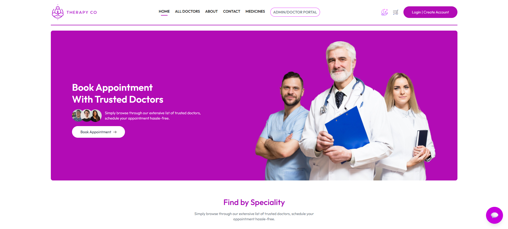

# 📸 Screenshot Guide

Place all screenshots in the `screenshots/` folder with these exact filenames:

## Required Screenshots (10 Essential)

### 1. **homepage.png**
- **What to capture:** Full homepage with hero section, speciality menu, top doctors
- **How:** Open http://localhost:5173/ in browser, capture full page scroll

### 2. **chatbot-conversation.png**
- **What to capture:** Open chatbot with a conversation showing AI responses
- **How:** Click chatbot icon, ask 2-3 questions, capture the conversation

### 3. **video-call-active.png**
- **What to capture:** Active video call showing both doctor and patient panels
- **How:** Start a video consultation, capture the two-panel video interface

### 4. **incoming-request-doctor.png**
- **What to capture:** Doctor's incoming consultation request overlay
- **How:** Patient requests instant consultation, capture doctor's RequestOverlay modal

### 5. **patient-appointments-with-join-button.png**
- **What to capture:** Patient's "My Appointments" page showing "Join Video Call" button
- **How:** Navigate to /my-appointments with paid appointments, capture the list

### 6. **scheduled-consultations.png**
- **What to capture:** Blue section showing scheduled consultations with date/time
- **How:** After doctor schedules for later, capture the notifications section

### 7. **prescription-modal-doctor.png**
- **What to capture:** Doctor's prescription writing modal
- **How:** Click complete appointment, capture the prescription input modal

### 8. **prescription-view-patient.png**
- **What to capture:** Patient viewing prescription in completed appointment
- **How:** Patient clicks "View Prescription" on completed appointment

### 9. **pharmacy-store.png**
- **What to capture:** Medicines listing page with search/filters
- **How:** Navigate to /medicines, capture the grid layout

### 10. **email-reminder.png**
- **What to capture:** The HTML email received in inbox
- **How:** Run `node test-email-sending.js`, check inbox, screenshot the email

---

## Additional/Optional Screenshots

### 11. **medicine-detail.png**
- Medicine detail page with tabs (description, usage, side effects)
- Navigate to any medicine from /medicines

### 12. **shopping-cart.png**
- Cart page with items and checkout
- Add items to cart, navigate to /cart

### 13. **admin-dashboard.png**
- Admin dashboard with statistics
- Login as admin, capture dashboard

### 14. **doctor-appointments.png**
- Doctor's appointments list with action buttons
- Login as doctor, go to Appointments tab

### 15-17. **Mobile Screenshots**
- **mobile-home.png** - Homepage on mobile (375px width)
- **mobile-chat.png** - Chatbot on mobile
- **mobile-appointments.png** - Appointments on mobile
- Use browser DevTools responsive mode (iPhone 12 Pro size)

---

## Quick Capture Tips

### For Desktop Screenshots:
1. Use browser at 1920x1080 resolution
2. Hide browser controls (F11 fullscreen)
3. Use Snipping Tool or browser extensions
4. Save as PNG format
5. Optimize file size (max 500KB per image)

### For Mobile Screenshots:
1. Chrome DevTools → Toggle Device Toolbar (Ctrl+Shift+M)
2. Select "iPhone 12 Pro" or similar
3. Capture the device frame for better presentation
4. Or use actual mobile device and take screenshots

### Screenshot Tools:
- **Windows:** Snipping Tool (Win+Shift+S)
- **Mac:** Cmd+Shift+4
- **Browser Extensions:** Awesome Screenshot, GoFullPage (for scrolling pages)

---

## Example Workflow

```bash
# 1. Start all services
cd backend && npm start
cd frontend && npm run dev
cd admin && npm run dev

# 2. Create test data if needed
# - Register user account
# - Book appointments
# - Add doctor profile

# 3. Run email test
cd backend
node test-email-sending.js
# Check email inbox for screenshot

# 4. Capture each screenshot following the list above
# Save with exact filename in screenshots/ folder

# 5. Verify all images
ls screenshots/
# Should show 10-17 PNG files

# 6. Add to git
git add screenshots/
git commit -m "docs: Add project screenshots"
git push
```

---

## After Screenshots Are Added

Your README will automatically display them because the image paths are already configured:

```markdown


...etc
```

GitHub will render these images automatically once the files are pushed to the repository!

---

**Priority Order:**
1. Homepage (first impression)
2. Chatbot conversation (key feature)
3. Video call active (main functionality)
4. Patient appointments with join button (user flow)
5. Email reminder (automation showcase)
6. Pharmacy store (e-commerce component)
7. Everything else

**Minimum for Good README:** At least screenshots 1-6 above.
